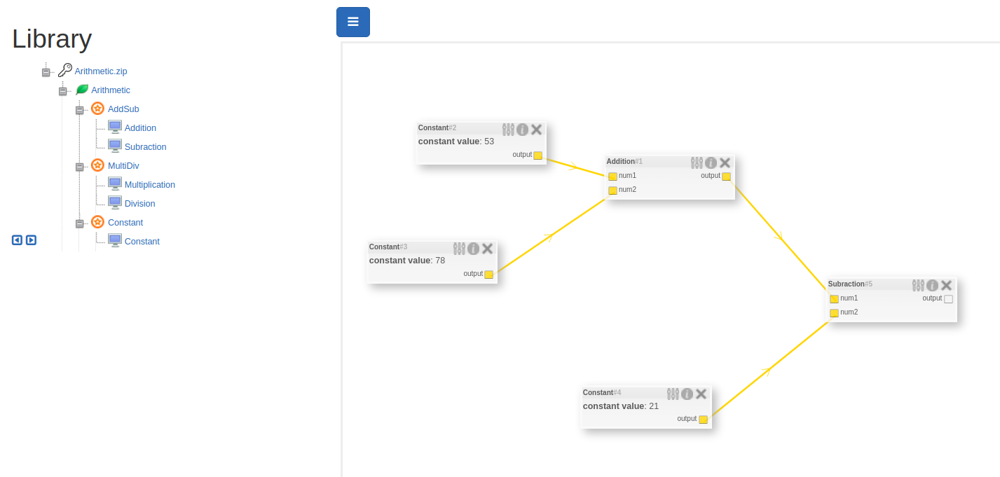
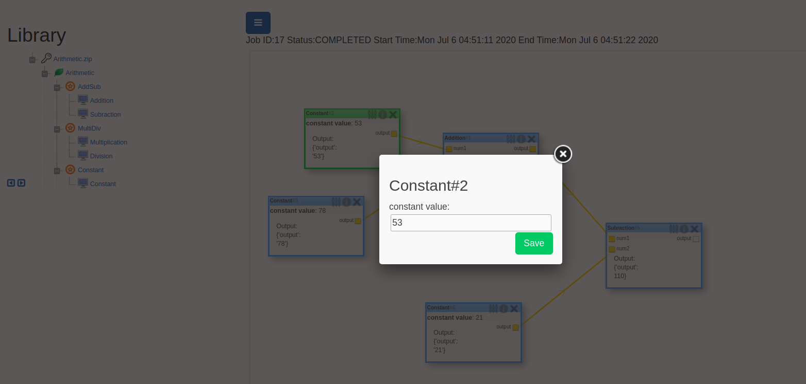
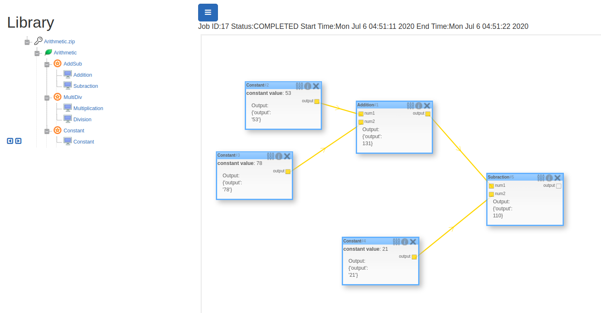

# Blocks Documentation


## About blocks and workflow

A block is a method that takes input and produces output when executed. Each block has editable parameters that have some default value.

A workflow is a group of blocks connected to each other where the output of one block is the input for the other. Workflows do not necessarily mean a single flow of execution, it could have multiple parallel flows.

Consider a simple workflow using the Arithmetic module:
- As you can see the output of the constant block is connected to the input of the addition block.  
- Each constant block has an editable parameter deciding the value of the constant block, as seen in the below image.   

  
    

On executing the above workflow, the result produced by the workflow is shown here.
    

To define a block we need to specify the inputs, outputs, properties, and the execution function.

The execution function may use the inputs and the properties to perform some operation and produce a single visualization and multiple outputs variables. The visualization” Previous Output” can be used to see intermediate results. The outputs (Operand3) can then be forwarded as input to another block.

## Create New Custom Blocks

Before we learn how to create a new custom block, lets first see predefined classes:

```python
class Block(object):

    family = "Default Family"
    name = "Default Name"

    def __init__(self):
        pass

    def input_params(self,data):
        pass

    def execute(self):
        pass
```
```python
class BlockInput:

    def __init__(self,name:str, min_cardinality:int, max_cardinality:int, attribute_type:str):
        if not (isinstance(name,str) and isinstance(min_cardinality,int) and isinstance(max_cardinality,int) \
            and isinstance(attribute_type,str)):
            raise TypeError("Incorrect parameter type")
        self.name = name
        self.value = None
        self.min_cardinality = min_cardinality
        self.max_cardinality = max_cardinality
        self.attribute_type = attribute_type

    def set_value(self,value):
        self.value = value
```
```python
class BlockOutput:

    def __init__(self, name:str, attribute_type:str, min_cardinality:int, max_cardinality:int):
        if not (isinstance(name,str) and isinstance(min_cardinality,int) and isinstance(max_cardinality,int) \
            and isinstance(attribute_type,str)):
            raise TypeError("Incorrect parameter type")
        self.name = name
        self.value = None
        self.max_cardinality = max_cardinality
        self.min_cardinality = min_cardinality
        self.attribute_type = attribute_type

    def set_value(self,value):
        self.value = value
```        
```python
class BlockParameter:

    def __init__(self, name:str, attribute_type:str, defaultvalue=None):
        if not (isinstance(name,str) and isinstance(attribute_type,str)):
            raise TypeError("Incorrect parameter type")
        self.name = name
        self.value = defaultvalue
        self.attribute_type = attribute_type

    def set_value(self,value):
        self.value = value
```
```python
class ParameterType:

    NUMBER = "NUMBER"
    NUMBER_ARRAY = "NUMBER[]"
    STRING = "STRING"
    STRING_ARRAY = "STRING[]"
    FILE = "FILE"
    FILE_LOCATION = "FILE_LOCATION"
    FILE_ARRAY = "FILE[]"
    BOOLEAN = "BOOLEAN"
    OBJECT = "OBJECT"
```

To define a block in python, as shown in the last image, we need to follow the design pattern
- Every block must be a python class which should inherit the ```Block``` class (shown above)
- The new block class that you create will override ```input_params``` and ```execute``` method of ```Block``` class
- Input, Output and editable Parameter variables of the custom block should be an instance of ```BlockInput```, ```BlockOutput``` and ```BlockParameter``` class respectively
- Create the input, output and editable parameter instance variables in the ```__init__``` method of our custom class
- Assign the value to the above variables (except output variables) in ```input_params``` method
- The ```input_params``` method takes ```data``` as the only parameter. ```data``` is a dictionary of string-value pair, where the key is the variable name (string) and value is the value to be assigned to that variable
- Override the ```execute``` method in which assign the value to the output variables
- Lastly, override the ```Block``` class variables ```family``` and ```name``` to family the block belongs to and the name of the block

In order to understand it better, let's take the example of the **Arithmetic Module**.  
The Arithmetic module contains 5 blocks:
- Constant Block
- Addition Block
- Subtraction Block
- Multiplication Block
- Division Block

Let's see the ```Addition``` block class:
```python
import time

from blocks.Block import Block 
from blocks.BlockInput import BlockInput
from blocks.BlockParameter import BlockParameter
from blocks.BlockOutput import BlockOutput
from blocks.ParameterType import ParameterType

class Addition(Block):

    family = 'AddSub'
    name = 'Addition'

    def __init__(self):
        self.num1 = BlockInput(
            name='num1',
            min_cardinality=1,
            max_cardinality=1,
            attribute_type=ParameterType.NUMBER
        )
        self.num2 = BlockInput(
            name='num2',
            min_cardinality=1,
            max_cardinality=1,
            attribute_type=ParameterType.NUMBER
        )
        self.output = BlockOutput(
            name='output',
            min_cardinality=1,
            max_cardinality=1,
            attribute_type=ParameterType.NUMBER
        )
        

    def input_params(self,data):
        self.num1.set_value(data['num1'])
        self.num2.set_value(data['num2'])

    def execute(self):
        value = self.num1.value + self.num2.value
        self.output.set_value(value)
```
As you can see we have defined all the variables in the **\_\_init__** method and assigned all the variables (except output variables) in ```input_params``` and output variables in ```execute``` method.  

**Note:  
While uploading custom module, path to import predefined ```Block```, ```BlockInput```, ```BlockOutput```, ```BlockParameter``` and ```ParameterType``` class should be:** 
```python
from blocks.Block import Block 
from blocks.BlockInput import BlockInput
from blocks.BlockParameter import BlockParameter
from blocks.BlockOutput import BlockOutput
from blocks.ParameterType import ParameterType
```


Now lets see ```Contant``` block class:  
```python
from blocks.Block import Block 
from blocks.BlockInput import BlockInput
from blocks.BlockParameter import BlockParameter
from blocks.BlockOutput import BlockOutput
from blocks.ParameterType import ParameterType

class Constant(Block):

    family = 'Constant'
    name = 'Constant'

    def __init__(self):
        self.num = BlockParameter(
            name='constant value',
            attribute_type=ParameterType.NUMBER,
            defaultvalue=10
        )
        self.output = BlockOutput(
            name='output',
            min_cardinality=1,
            max_cardinality=1,
            attribute_type=ParameterType.NUMBER
        )

    def input_params(self,data):
        self.num.set_value(int(data['constant value']))

    def execute(self):
        value = self.num.value
        self.output.set_value(value)
```
As you can see it is similar to the Addition block. Note that BlockParameter needs to have a default value.

**Note: Value for each ```BlockParameter``` instance variable comes as a string from frontend, hence it always needs to be type-casted. As you can see in the ```input_params``` method of Constant block, we type-casted the ```num``` variable to ```int``` which is a block parameter.**

Each variable input, output, or parameter has ```attribute_type```. The ```arrtibute_type``` is a **string** used by the frontend to prevent connections where types do not match. For example, if block1 needs an input of *list of integers* and block2 outputs just an *integer*, then connecting the output of block2 to the input of block1 should not be allowed. Hence ```atrribute_type``` helps in avoiding type mismatch.  

## Create Module

The Group of all the custom blocks forms a module. **Arithmetic module** consists of 5 blocks as mentioned above.

Note: For a module, always follow a proper directory structure of the family. Taking Arithmetic module as an example, the structure followed by it is shown below:  

```bash
├── Arithmetic
   ├── AddSub
   │   ├── __init__.py
   │   ├── Addition.py
   │   ├── Subraction.py
   ├── MultiDiv
   │   ├── __init__.py
   │   ├── Multiplication.py
   │   ├── Division.py
   ├── Constant
   │   ├── __init__.py
   │   ├── Constant.py
   └── __init__.py
```

Lastly:
- The outermost **\_\_init__.py** file should contain a dictionary variable called ```string_classobject_mapping```. The ```string_classobject_mapping``` is dict with key as ```CustomBlockclass.name``` and value as the instance of your custom block class, ```CustomBlockclass()```  

For Arithmetic module, the outermost **\_\_init__.py** file contains:  

```python
from .AddSub.Addition import Addition
from .AddSub.Subraction import Subraction
from .Constant.Constant import Constant
from .MultiDiv.Multiplication import Multiplication
from .MultiDiv.Division import Division

string_classobject_mapping = {
    Addition.name: Addition(),
    Subraction.name: Subraction(),
    Multiplication.name: Multiplication(),
    Division.name: Division(),
    Constant.name: Constant()
}
```

Check [Arithmetic Module](https://github.com/ronak66/EEG-Workflow-System/tree/master/blocks/Arithmetic) for better understanding.